# InternSprint Developer Guide

## Table of Contents

<!-- TOC -->
* [**Acknowledgements**](#acknowledgements)
* [**Setting Up and Getting Started**](#setting-up-and-getting-started)
* [**Design**](#design)
  * [Architecture](#architecture)
  * [UI Component](#ui-component)
  * [Logic Component](#logic-component)
  * [Model Component](#model-component)
  * [Storage Component](#storage-component)
* [**Implementation**](#implementation)
  * [Commands](#commands)
    * [1. Add new Internship](#1-add-new-internship)
    * [2. Edit an Internship](#2-edit-an-internship)
    * [3. Delete an Internship](#3-delete-an-internship)
    * [4. List all Internships](#4-list-all-internships)
    * [5. Create/Update User Profile](#5-createupdate-user-profile)
    * [6. Add/View Projects under User Profile](#6-addview-projects-under-user-profile)
* [**Logging Guide**](#logging-guide)
* [**Product scope**](#product-scope)
  * [Target user profile](#target-user-profile)
  * [Value proposition](#value-proposition)
* [**User Stories**](#user-stories)
* [**Non-Functional Requirements**](#non-functional-requirements)
* [**Glossary**](#glossary)
* [**Instructions for manual testing**](#instructions-for-manual-testing)

## Acknowledgements

Special thanks to the authors of [addressbook-level3](https://se-education.org/addressbook-level3/DeveloperGuide.html#acknowledgements)
for their Developer Guide, used here as a reference for the following DG:

**Third party libraries used:**

* [JSON in Java](https://mvnrepository.com/artifact/org.json/json): Used to store and retrieve data from JSON files.
* [PrettyTime](https://mvnrepository.com/artifact/org.ocpsoft.prettytime/prettytime): 
Used to format timestamps in a human-readable format.
* [Natty](https://mvnrepository.com/artifact/com.joestelmach/natty): 
Used to parse natural language date and time strings.
* [ASCII Table](https://mvnrepository.com/artifact/de.vandermeer/asciitable): Use to render tabular view of information 
in UI for user profile and projects.

## Setting Up and Getting Started
> **Caution:**
Follow the steps in the following guide precisely. Things will not work out if you deviate in some steps.

> **Note:** `execute(InternshipList internships, UserProfile user)` will be referenced as `execute()` throughout 
> the document for brevity. The sequence diagrams will still show the full method signature.

First, **fork** this repo, and **clone** the fork into your computer.

If you plan to use Intellij IDEA (highly recommended):

1. **Configure the JDK**: 
Follow the guide [[se-edu/guides] IDEA: Configuring the JDK](https://se-education.org/guides/tutorials/intellijJdk.html)
to ensure Intellij is configured to use **JDK 17**.
2. **Import the project as a Gradle project**:
Follow the guide [[se-edu/guides] IDEA: Importing a Gradle project]
(https://se-education.org/guides/tutorials/intellijImportGradleProject.html) to import the project into IDEA.
> Note: Importing a Gradle project is slightly different from importing a normal Java project.
3. **Verify the setup:**
   * Run the `seedu.internsprint.InternSprint` and try a few commands.
   * Run the tests in the `src/test` directory to ensure everything is working as expected.

## Design

> **Tip:** The diagrams are created using [drawio](https://app.diagrams.net/). 
> Refer to their website for more information.
> All our `drawio` source files are accessible through the link 
> [here](https://drive.google.com/drive/folders/1hVXLhsZNU8a1vo4MaV5R5RIYIZGSaXSu?usp=drive_link)

### Architecture

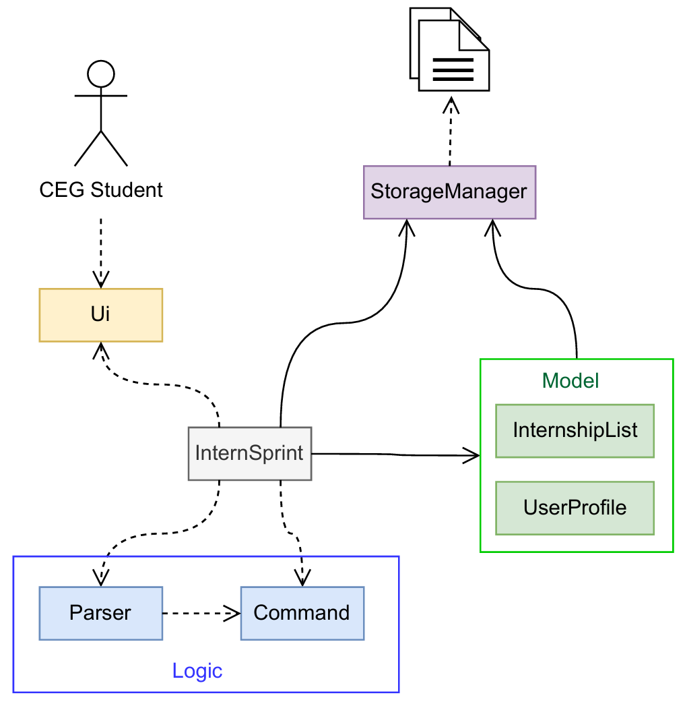

The **Architecture Diagram** above shows the high-level implementation of the InternSprint application.

Given below is a quick overview of our main components and their interactions.

**Main Components:**

`InternSprint` class is responsible for the launch and shutdown of the entire program.
* At application launch, it initializes the `StorageManager`, `InternshipList`, `UserProfile`, and `ProjectList` components.
* All data is saved immediately after command execution. So during application shutdown, an exit message is displayed to
user and the garbage collector ensures the necessary cleaning automatically.

The bulk of the application logic is done by the following 4 components:
* `Ui` - Handles user input and output.
* `Logic` - Parses user input and executes commands.
* `Model` - Stores and manages the data.
* `Storage` - Reads and writes data to and from the disk.

**How the components interact:**

The *Sequence Diagram* demonstrating the interaction between these 4 components is described below under the `Ui` 
component. The `Ui` component can be accessed [here](#ui-component).

Each of the 4 components has its API defined either in an `interface` or in an `abstract` class with the same name as the package.
* The `Ui` component is a single class.
* The `Logic` component consists of two main parts: the `Parser` and the `Command` packages.
  * The `command` package defines its API in the abstract `Command.java` class.
  * The `parser` package is made up of two single classes: `CommandParser.java` and `DateTimeParser.java`.
* The `Model` component consists of two packages: `internship` and `userprofile`.
  * The `internship` package defines its API in the abstract `Internship.java` class. 
  * There is also an `interview` package that contains the `Interview.java` and `InterviewEntry.java` classes.
  * The `userprofile` package is a single class.
  * The `userprofile` package consists `project` package whose API is defined in the abstract `Project.java` class.
* The `Storage` class defines its API in the `Storage.java` interface.

### UI Component

The text-based UI component for this app is responsible for handling user input and output. Stored under the `util` 
package, the UI acts as the front-facing component for the application architecture. 
The sequence diagram below shows how the components interact with each other highlighting the role and placement of 
the UI component in our application as it:
1. Reads in string from the user 
2. Returns this string for command execution by the Logic component.
3. Receives the result of command execution
4. Displays these command result in a visually intuitive cohesive manner in the terminal window.
   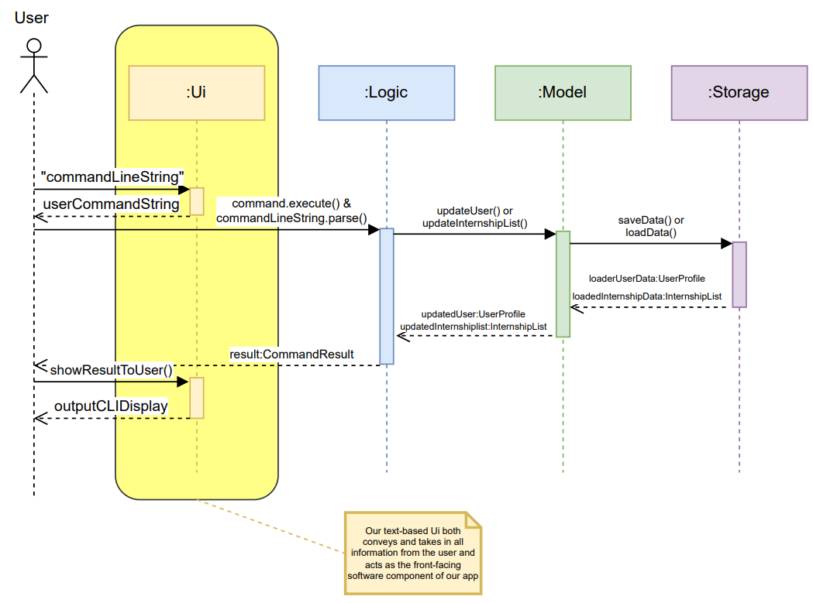


References to the UI component exists only in the InternSprint public class itself to reduce tight coupling
and UI only deals in formatting and returning Strings from and to the user such that the Logic component does not have
to print to terminal directly and can be isolated to parsing and command execution, ensuring separation of concerns.

The below class diagram is a brief overview of the static and public methods contained in UI, and showcases class
dependencies. This UML diagram omits certain class level members and attribute for Internship class among others to
ensure clarity and conciseness. Essentially, UI is only referenced in one method of the InternSprint class and only holds a reference
to the Internship class, illustrating avoidance of tight coupling and singularity of purpose for UI (no overlap between
logic and UI).


### Logic Component

The `Logic` component consists of two main parts: the `Parser` and the `Command` classes.

**Parser:** Parser is made up of two classes: `CommandParser` and `DateTimeParser`.

1. **CommandParser:** The `CommandParser` class takes a single line of user input and splits it into a command word and key value pairs.
   * The command word is used to determine the type of command that needs be executed, and creates the corresponding
     `*Command` object (e.g., `AddInternshipCommand`, `DeleteCommand`, `ListCommand`).
   * The key value pairs are stored in a `HashMap<String, String>` of the `Command` object. The key value pairs are
     validated only during command execution in `isValidParameters()` method.

2. **DateTimeParser:** This class is responsible for parsing natural language date and time strings entered by the user, and to
display them in a human-readable format. It makes user of the `Natty` and `PrettyTime` libraries to parse and format
date and time strings respectively.

**Command:** The `Command` class is an abstract class that represents a command that the user can execute.
It provides an additional layer of abstraction between the user input and the actual execution of the command,
achieving the **SoC (Separation of Concerns)** design principle.

The abstract `Command` class has the following abstract methods:
* `isValidParameters()`: Validates the parameters of the command. The parameters are set by `CommandParser` class while
  parsing the user input.
* `execute()`: Executes the command.

These methods override the abstract methods of the `Command` class through **polymorphism**.

Here is a partial class diagram of related classes in the Logic component:

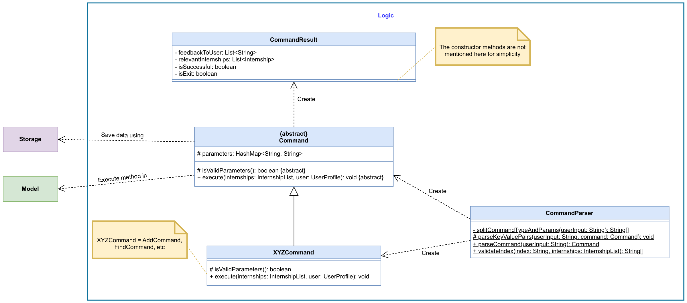

`DateTimeParser` class is not shown in the diagram, as it is used by the model component to parse date and time strings.

The sequence diagram below illustrates the interactions within the `Logic` component when `execute()` method is called
for user input `delete /index 1`.

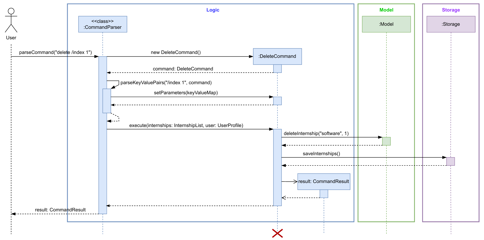

> **Note:** The purpose of the sequence diagram above is solely to illustrate the interactions between the classes in
> logic component. Implementation details such as how the input is parsed, execution of command in `DeleteCommand` and
> steps in deleting an internship in `Model` are omitted for clarity. You can take a look at the implementation section
> of this Developer Guide for more details.

**How the `Logic` Component works:**
1. When user inputs a command, the `InternSprint` class calls the `parseCommand(String userInput)` method from 
`CommandParser` class to parse the input.
2. Depending on the first 1 - 2 words of the input, the `CommandParser` class creates a `Command` object (an object of
one of its subclasses e.g., `DeleteCommand`).
3. This command object communicates with the `Model` when it is executed through the `execute()` method.
4. The result of the command execution is returned to the `InternSprint` class as a `CommandResult` object.


### Model Component

The **Model** component is responsible for storing, managing and providing access to all the data used by the 
InternSprint . It represents the internal state of the application and is updated based on commands entered by the user.

#### Responsibilities
- Store internship information (company name, role, description, etc.)
- Support three internship types: Software, Hardware and General.
- Store and manage interviews (including multiple rounds per internship)
- Handle user information and goals via the `UserProfile`

#### Package Structure

```
model
├── internship
│   ├── Interview          
│   │    ├── Interview.java      # Represents a single interview (including optional rounds)
│   │    ├── InterviewEntry.java # Wrapper class pairing an Interview with its Internship    
│   ├── GeneralInternship.java   # Internship subclass for general roles
│   ├── HardwareInternship.java  # Internship subclass for hardware roles
│   ├── SoftwareInternship.java  # Internship subclass for software roles
│   ├── Internship.java          # Abstract class defining an internship's structure
│   └── InternshipList.java      # Contains and manages the internship collection
└── userprofile
    └── Project
    │    └── GeneralProject.java  # Project subclass for general projects
    │    └── HardwareProject.java # Project subclass for hardware projects
    │    └── SoftwareProject.java # Project subclass for software projects
    │    └── ProjectList.java     # Contains and manages the projects
    │    └── Project.java         # Project class defiing a project's structure
    └── UserProfile.java          # Stores user preferences (companies, roles, goals, etc.)
```


#### Key Classes and Their Roles

| Class                                 | Role                                                              |
|---------------------------------------|-------------------------------------------------------------------|
| `Internship`                          | Abstract base class for internships                               |
| `General/Software/HardwareInternship` | Specific implementations depending on type                        |
| `InternshipList`                      | Stores internships in a HashMap by category (`software`, etc.)    |
| `Interview`                           | Represents one interview round, with optional next rounds         |
| `InterviewEntry`                      | A wrapper for pairing an `Interview` with its parent `Internship` |
| `UserProfile`                         | Stores user preferences for use across the application            |
| `Projects`                            | Abstract base class for projects                                  |
| `General/Software/HardwareProjects`   | Specific implementations depending on type                        |
| `ProjectList`                         | Stores projects in a Hashmap by category                          |


#### Model UML Diagrams

The overall system model has been divided into two separate UML diagrams.The decision to separate these models is based 
on the fact that user profiles and projects have no direct association with internships and interviews. By splitting the 
diagrams, we accurately represent the system architecture.

*Internships and Interview Diagram*
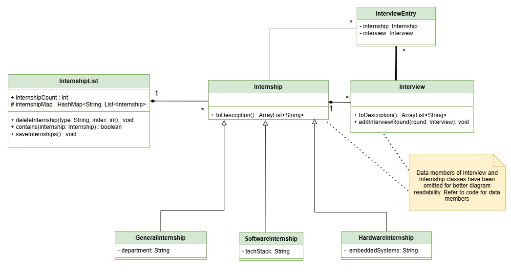
*User Profile and Projects Diagram*
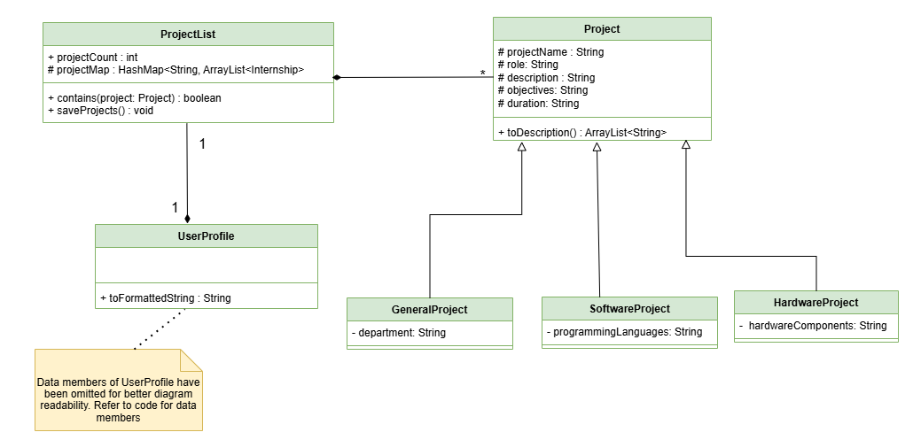


### Storage Component

The Storage component is responsible for managing saving and loading in the application.
It ensures that user data, such as internships, projects, profiles, and interviews, 
are stored and retrieved efficiently.

#### Key Classes and Their Roles

1. **StorageManager Class**: It acts as the central controller for the storage system. It implements a 
singleton pattern to ensure only one instance exists throughout the application. It manages multiple 
storage handlers, each responsible for handling a specific type of data.
2. **Storage Class**: It acts as the central interface, interacting with the 
storage handlers `InternshipStorageHandler`, `InterviewStorageHandler`, `ProjecttorageHandler` 
and `ProfileStorageHandler` to manage the saving and loading of different types of data.

Here is a class diagram of related classes in the Storage component:

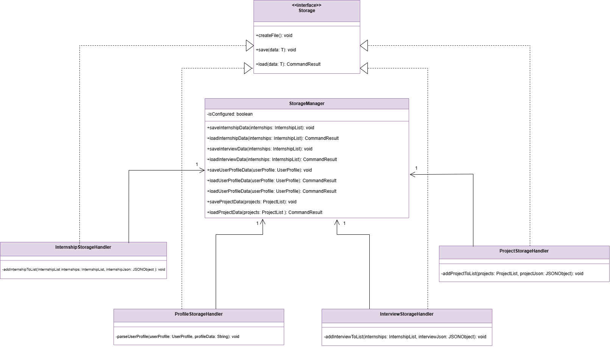

**How the `Storage` Component works:**
1. When the user performs an action that modifies stored data (e.g., adding or deleting an internship), 
the corresponding `Command` class interacts with the `InternshipList`.
2. The `InternshipList` then calls the `saveInternships()` method, which delegates the saving process 
to the `StorageManager`.
3. The `StorageManager` calls the appropriate storage handler, such as `InternshipStorageHandler`, 
to write the updated data to a file.
4. The data is saved persistently and can be reloaded when the application starts or when requested by the user.

#### Summary of All Storage Classes and Their Roles

| Class                      | Role                                                                |
|----------------------------|---------------------------------------------------------------------|
| `Storage`                  | Abstract base class for storage related operations                  |
| `Storage Manager`          | Manages saving/loading processes for the different storage handlers |
| `InternshipStorageHandler` | Handles saving and loading of internship related data               |
| `InterviewStorageHandler`  | Handles data storage for interviews of internships                  |
| `ProfileStorageHandler`    | Handles data storage for the user's profile                         |
| `ProjectStorageHandler`    | Handles saving and loading of project related data                  |

---

## Implementation

This section describes some noteworthy details on how certain features are implemented.

### 1. Add new Internship

**Overview**:

This command allows the user to add a new internship to their list of internships. 
The new internship is immediately added to the `internships.txt` file at `../data/internships.txt`.

**How the feature is implemented:**

* The `AddInternshipCommand` class is an abstract class that extends from another the abstract class `Command`.
* The user can specify the type of internship he wants to add as `general`, `software` or `hardware` in the input.
Each type of internship has a separate class that extends the `AddCommand` class, 
`AddGeneralInternshipCommand`, `AddSoftwareInternshipCommand`, and `AddHardwareInternshipCommand`.
* These subclasses override the `isValidParameters()` and `execute()` 
methods to validate the parameters of the command, depending on the type of internship.
* The `execute()` method adds the new internship to the list of internships 
stored in `InternshipList` which it obtains as a parameter.
  * `InternshipList` class stores the list of internships as a HashMap. Each type of `Add*InternshipCommand` will insert
  the internship into the correct list.

**Why is it implemented this way:**

* By abstracting each type of internship into a separate class, the code achieves **SoC (Separation of Concerns)** 
design principle.
* Each subclass is now responsible for validating and executing the command for a specific type of internship, enabling
testing and debugging to be more focused and efficient.

**Alternatives Considered:**
* **Alternative 1 (Current choice):** Use separate classes for each type of internship.
  * Pros: Achieves **SoC (Separation of Concerns)** design principle.
  * Cons: Requires additional classes and code to be written.

* **Alternative 2:** Use a single `AddCommand` class and use a switch statement to determine the type of internship.
  * Pros: Reduces the number of classes and code to be written.
  * Cons: Violates the **SRP (Single Responsibility Principle)**.
* **Alternative 3:** Use a single `AddCommand` class and store the type of internship as a field in the `Internship`.
  * Pros: Reduces the number of classes and code to be written.
  * Cons: Requires additional validation to ensure that the type of internship is consistent with the parameters 
  provided by the user.

**Sequence Diagram:**

Below is the simplified sequence diagram for adding a new software internship. 
A similar sequence is followed for adding a general or hardware internship.

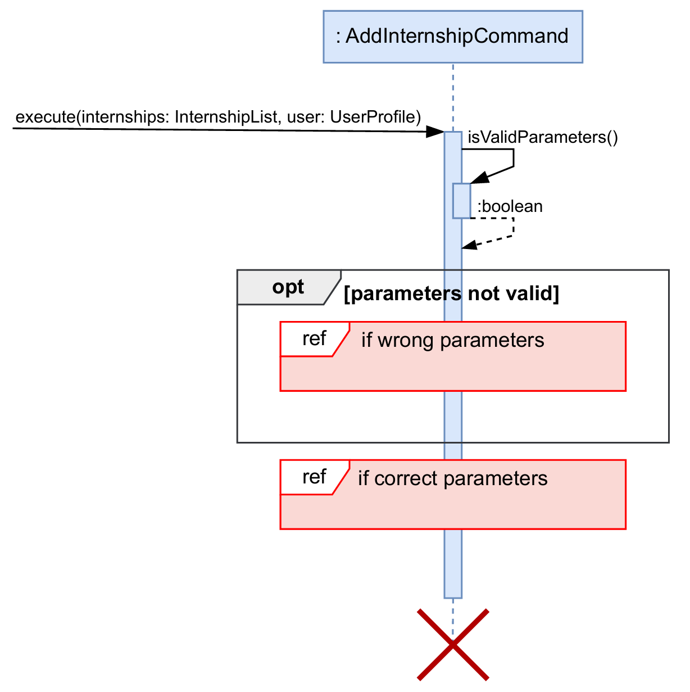

* `InternSprint.java` obtains the correct `*Command` object from the `CommandParser` class and calls the 
`execute()` method of that `*Command` object.
* `execute()` method first checks the validity of the provided parameters using the `isValidParameters()` method of
the same `*Command` object. As mentioned above, this method is overridden in each subclass to validate the parameters 
according to the type of internship.

* If the parameters are not valid (as depicted in the sequence diagram below), then a `CommandResult` with the correct 
usage message is returned to the user. The `isSuccessful` field of the `CommandResult` object is set to `false`.

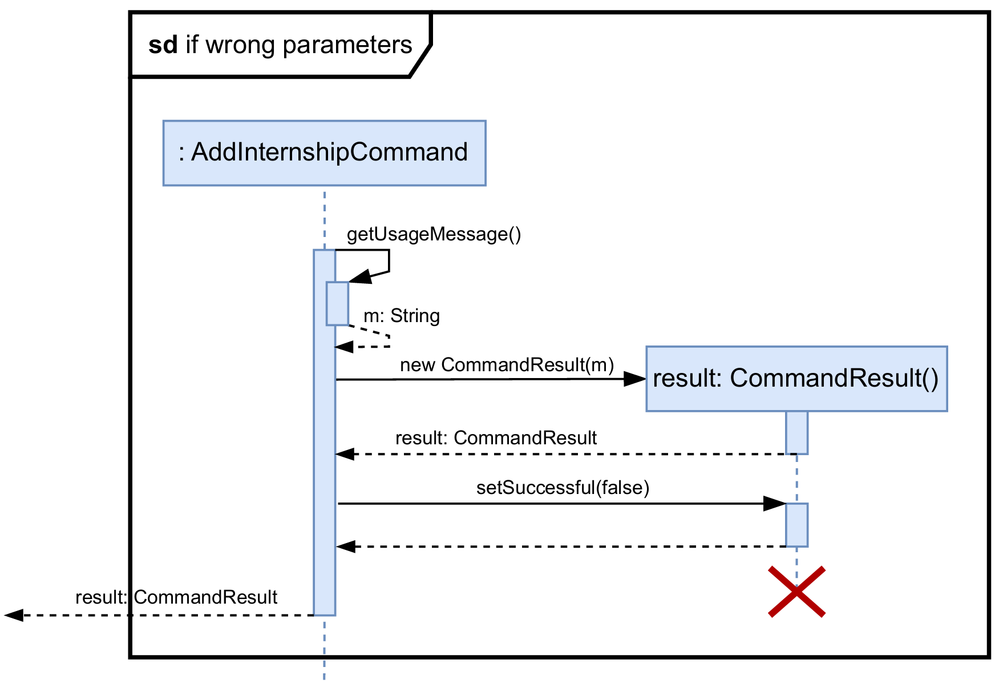

* If the parameters are valid (as depicted in the sequence diagram below), then a new internship 
(here `SoftwareInternship`) is created.
  * If the new internship already exists in the list, then a `CommandResult` with appropriate error message is returned.
  * Else, the new internship is added to the list of internships. 
  * Depending on whether the internships are successfully saved to the `internships.txt` file, 
  a `CommandResult` is returned. The reference frame for saving internships is omitted in the diagram to focus on the
  details of adding a new internship.

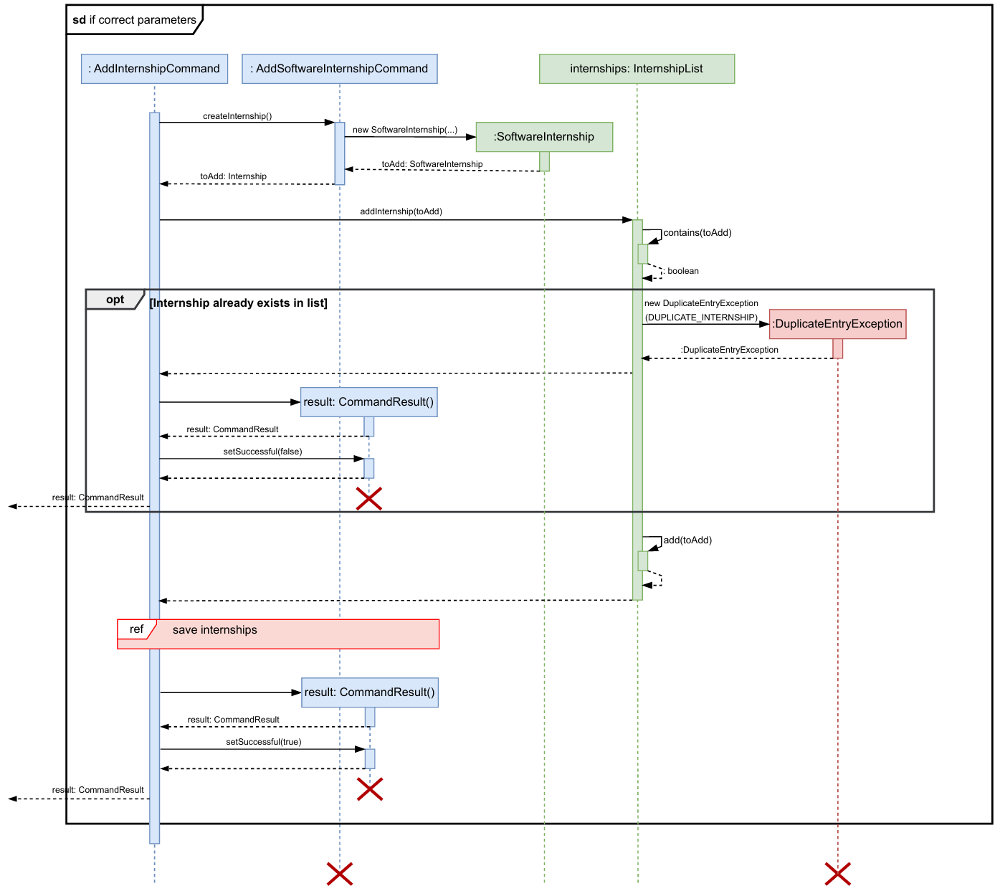

* Print calls, assert statements, logging, and other non-essential calls are omitted in the diagram for clarity.

### 2. Edit an Internship

**Overview**:

This command allows the user to edit the parameters of their prexisting internship in their list. This update  
is immediately added to the `internships.txt` file at `../data/internships.txt`.

**How the feature is implemented:**

* The `EditCommand` class is an abstract class extends from the abstract class `Command`.
* The user can specify different parameters they could edit: both the basic parameters for `general`, `software` or 
`hardware` internships and additional extended parameters through the use of flags. All parameters are optional 
and can be used on an as-needed basis.
* The mandatory flag `/index` is required to be entered by the user, and checked for in `isValidParameters()`.
This method also checks if all flags entered by user are predefined in `POSSIBLE_PARAMETERS` set.
* The `execute()` method calls `editParametersForFoundInternships()` to validates the `\tech` and `\hardtech` 
parameters of the command, depending on the type of internship and sets the edited parameters accordingly
  * `parameters` is stored as key-value pairs(hash-map) within Command super class.

**Why is it implemented this way:**
* By making use of the `edit /index` format here, instead of `edit general /index` we aimed to make the user experience
for simpler and more intuitive to understand. It may become tedious for the user to continue to retype lengthy 
internship type every time, especially since the `list` command enumerates all internships as one list cohesively.
This approach to improve simplicity and cohesion of updating internship list is maintained in other commands such as 
`delete`.
* By providing the user a range of possible extended parameters to edit and add, their experience is more streamlined
in that when creating an internship they are limited to adding the necessary information, but more advanced users 
can extend these capabilities through keys like `/status` or `/desc` for status and description respectively.


**Alternatives Considered:**
* **Alternative 1 (Current choice):** Use a single `EditCommand` class and allow user to edit the extended set of 
optional parameters using flags
  * Pros: Simpler, user-friendly command-line interface
  * Cons:Requires additional validation to ensure that the type of internship is consistent with the parameters provided
    by the user.

* **Alternative 2:** Only allow user to edit the same set of parameters used when creating the internship
  * Pros: Reduces the number of parameter checking, getting and setting code to be written.
  * Cons: This limits the functionality for our users and the information that can be entered for each internship.
* **Alternative 3:** Use separate classes for each type of internship.
  * Pros: Achieves **SoC (Separation of Concerns)** design principle.
  * Cons: Requires additional classes and code to be written.

**Sequence Diagram:**

Below is the sequence diagram for editing internship. Note this is an overview sequence diagram in which method flow has 
been simplified using reference frames, expanded on below to help aid in clarity. 

* `InternSprint.java` obtains the correct `EditCommand` object from the `CommandParser` class and calls the
  `execute()` method of that `EditCommand` object.
* `execute()` method first checks the validity of the provided parameters using the `isValidParameters()` method of
  the same `*Command` object. As mentioned above, this method is overridden in each subclass to validate the parameters
required for that command. For the `EditCommand` this involves a check that flags are present in predefined set and index
is present. 
* If the parameters are not valid (as depicted in the sequence diagram below), then a `CommandResult` with the correct
    usage message is returned to the user. The `isSuccessful` field of the `CommandResult` object is set to `false`.
* If the parameters are valid (as depicted in the sequence diagram below), then the specified index is found in the 
internship list. If the internship could not be found, or the user attempts to edit parameters incorrectly (e.g. they 
try to edit hardware tech for a software role) an unsuccessful result is returned to the user
* After making the required edits to the found internship, if there is a duplication of an existing internship is observed
an unsuccessful result is returned to the user.
* If no duplicates are found and execution of editParameters...() is successful, the edited internship is added to the list of internships
and a successful execution result is returned to the user.
* Depending on whether the internships are successfully saved to the `internships.txt` file,
  a `CommandResult` is returned. The reference frame for saving internships is similar to the reference frame 
  under `DeleteCommand`.

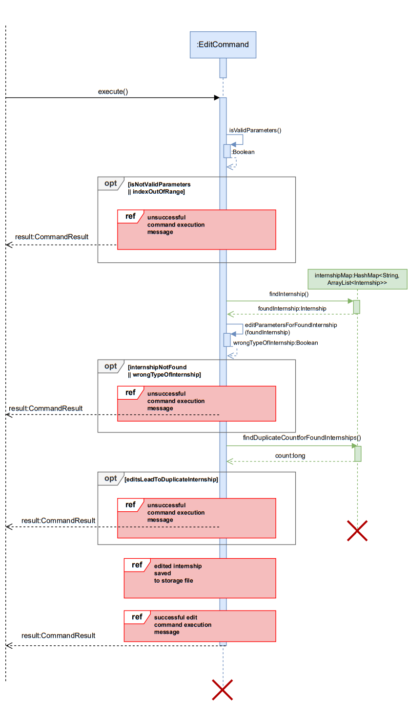

Below are the expanded reference frames for successful and unsuccessful CommandResults returned by execute() method.

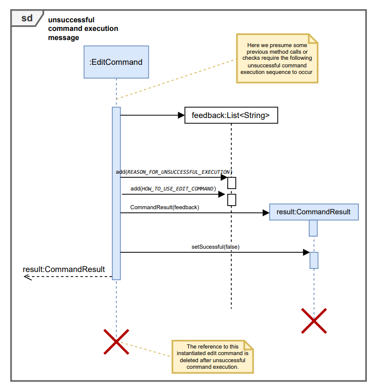
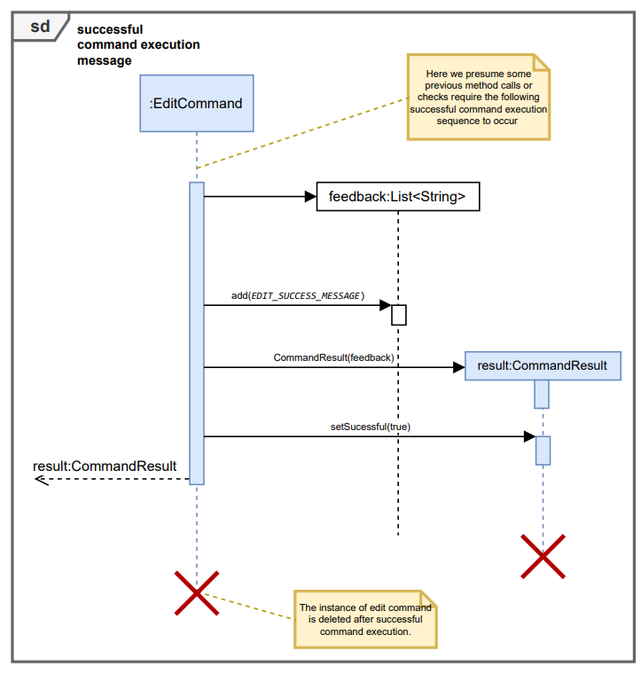


* Print calls, assert statements, logging, and other non-essential calls are omitted in the diagram for clarity.
For full clarity, note below is a comprehensive sequence diagram, combining all reference frames and expanding logic
behind duplicate-checking for example. Note this is only added for completeness for this one Command class, and only
to supplement an additional level of detail to above overview diagram (which should be sufficient for understanding).
Such an expanded view will be isolated to this one command but execution logic resembles other Commands,

hence can refer to this diagram for thoroughness for all such commands.


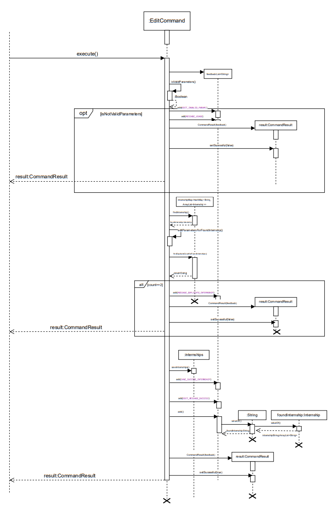

### 3. Delete an Internship

**Overview**:

This command allows the user to delete an internship from the list of internships. The deleted internship is 
immediately removed from the `internships.txt` file at `../data/internships.txt`.

**How the feature is implemented:**

* The `DeleteCommand` class is an abstract class extends from the abstract class `Command`. 
* The user is required to specify the `/index` flag, which is a mandatory parameter to indicate which internship 
should be deleted.
* The `isValidParameters()` method ensures that the required `/index` flag is provided by the user before proceeding 
with execution. 
* The `execute()` method retrieves the internship entry from the internship list based on the provided index. 
It then removes the internship entry from the list and attempts to save the updated internship list.
Feedback messages indicating success or failure, including errors such as missing or invalid indices are returned.
  * `index parameter` is stored as a key-value pair in the `parameters` Hashmap.
   
**Why is it implemented this way:**

* The /index flag is made mandatory to ensure users specify exactly which internship to delete, 
preventing accidental removals.
* By making use of the `delete /index` format here, instead of `delete general /index` we aimed to make the user 
experience for simpler and more intuitive to understand. It may become tedious for the user to continue to retype 
lengthy internship type every time, especially since the `list` command enumerates all internships as 
one list cohesively. This approach to improve simplicity and cohesion of updating internship list 
is maintained in other commands such as `edit`.

**Alternatives Considered:**
* **Alternative 1 (Current choice):** Use a single `DeleteCommand` class and allow user to delete an internship from
the internship list.
  * Pros: Simpler, user-friendly command-line interface
  * Cons: Deletion is irreversible, meaning accidental deletions cannot be undone without re-entering 
the internship details manually.

* **Alternative 2:** Use separate classes for each type of internship.  
  * Pros: Achieves **SoC (Separation of Concerns)** design principle.
  * Cons: Requires additional classes and code to be written.

**Sequence Diagram:**

Below is the sequence diagram for deleting internship. This is an overview sequence diagram in which method flow has
been simplified using reference frames, expanded on below to help aid in clarity.

* `InternSprint.java` obtains the correct `DeleteCommand` object from the `CommandParser` class and calls the
  `execute()` method of that `DeleteCommand` object.
* `execute()` method first checks the validity of the provided parameter using the `isValidParameters()` method of
  the same `*Command` object. For the `DeleteCommand` this methods check that if the index is valid and not missing.
* If the parameter is not valid (as depicted in the sequence diagram below), then a `CommandResult` with the correct
  usage message is returned to the user. The `isSuccessful` field of the `CommandResult` object is set to `false`.
* If the parameter is valid (as depicted in the sequence diagram below), then the specified index is found in the
  internship list.
* The internship at the index is then deleted and is removed from the list of internships. 
  A successful execution result is returned to the user.
* Depending on whether the internships are successfully saved to the `internships.txt` file,
  a `CommandResult` is returned. 

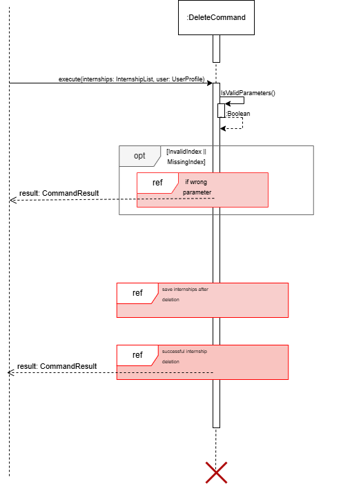

Below are the expanded reference frames for successful and unsuccessful CommandResults returned by execute() method.
The reference frame for saving internships can also be seen below.

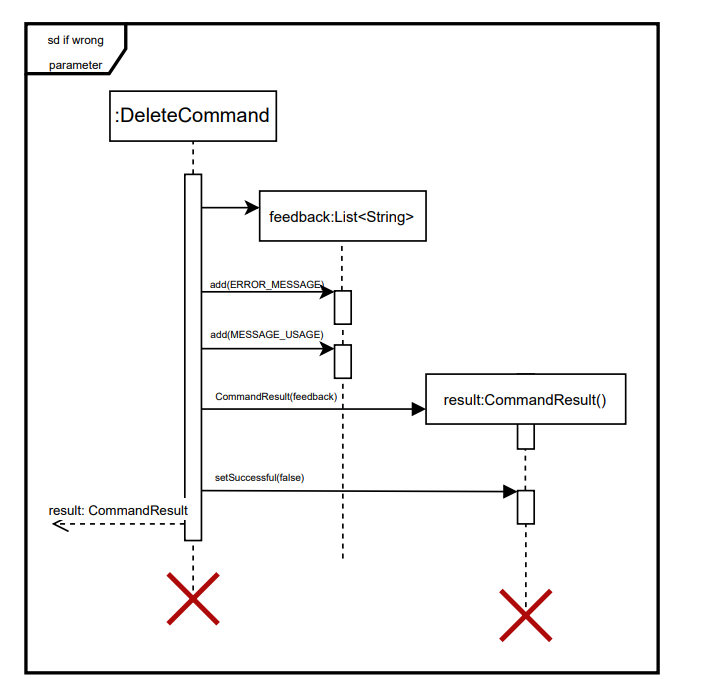

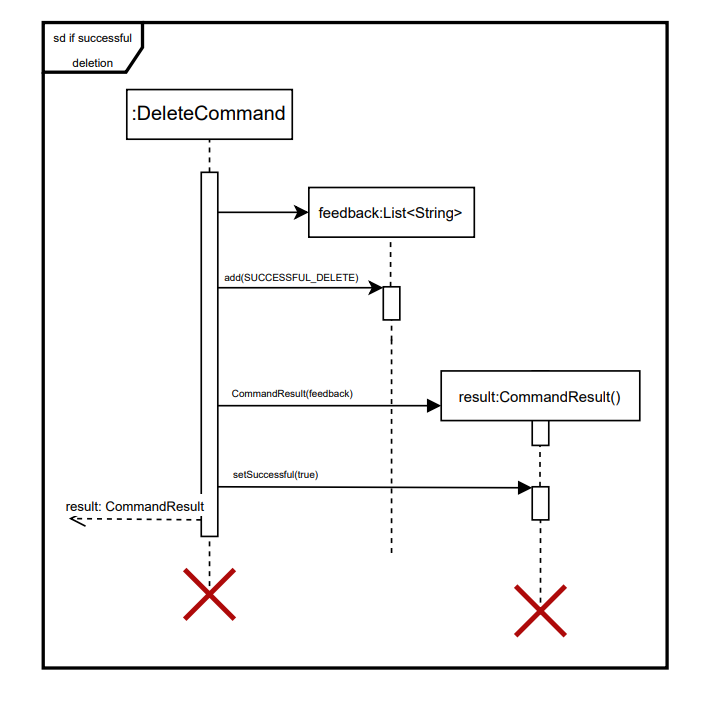

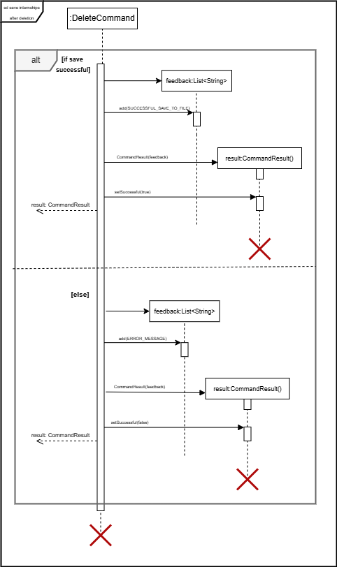

* Print calls, assert statements, logging, and other non-essential calls are omitted in the diagrams for clarity.
  
### 4. List all Internships
**Overview**:
This command allows the user to list all internships they have added. Data stored in internships.txt file at ../data/internships is retrieved to display the list of internships.

**How the feature is implemented:**

* The `listCommand` class is an abstract class that extends from the abstract class `Command`.
* The user is not supposed to provide any additional parameters
* The `isValidParameters()` method ensures that no extra parameters is provided by the user before proceeding
  with execution.
* The `execute()` method receives an InternshipList(which stores internships categorized by type in a HashMap) and a UserProfile.
  The method then iterates over each internship category (software, hardware, general), retrieves the corresponding list from the HashMap, and constructs a formatted output. Each internship is numbered sequentially. If no internships are found, it returns a CommandResult with a specific “No internships found” message.

**Why is it implemented this way:**
* The parameters are checked to ensure they are empty so that users do not wrongly try to provide /index flags to list to view a particular internship. Instead, list will give a list of all internships added.
* By listing all internships from different categories in one command, the user gets a comprehensive view of their data without having to invoke separate commands for each type, allowing for a unified and cohesive output.

**Alternatives Considered:**
* **Alternative 1:** Separate Listing Commands for Each Internship Type
  * Pros: 
    - Could allow for specialized handling of different internship types.
  * Cons: 
    - Would increase the number of classes and overall code complexity.
    the internship details manually.
    - Users would need to run multiple commands to see a full list, leading to a fragmented user experience.


* **Alternative 2:**  A Switch Statement Within a Single Command
  * Pros: 
    - Could handle each category differently if needed by using a switch-case block.
  * Cons: 
    - Loses the benefits of a unified, streamlined command interface.
  
**Sequence Diagrams**<br>
Below are the sequence diagrams for listing all internships.  

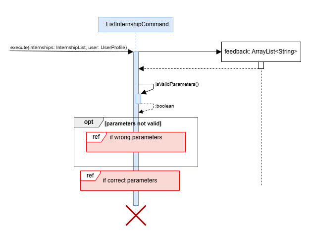
* The execute() method of the ListCommand class is called

* Execute() method checks the validity of the parameters using the isValidParameters() method.
 
* If extra parameters are entered(as depicted in the sequence diagram below), it will be invalid and hence, a commandResult with the correct usage message is returned to the user. 

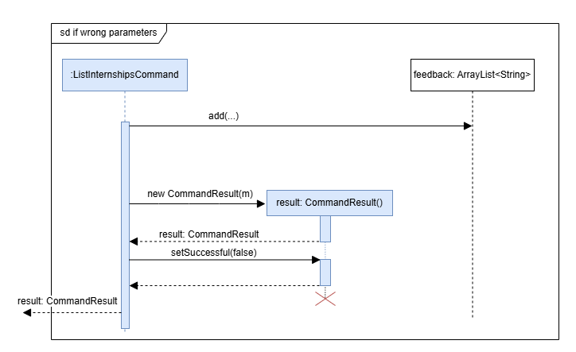
* If the parameters are valid (as depicted in the sequence diagram below), then the internships in the internship list are iterated through by catergory (software, hardware, general) and added to a arrayList as formatted strings.

* A command result containing these internships is then returned.
  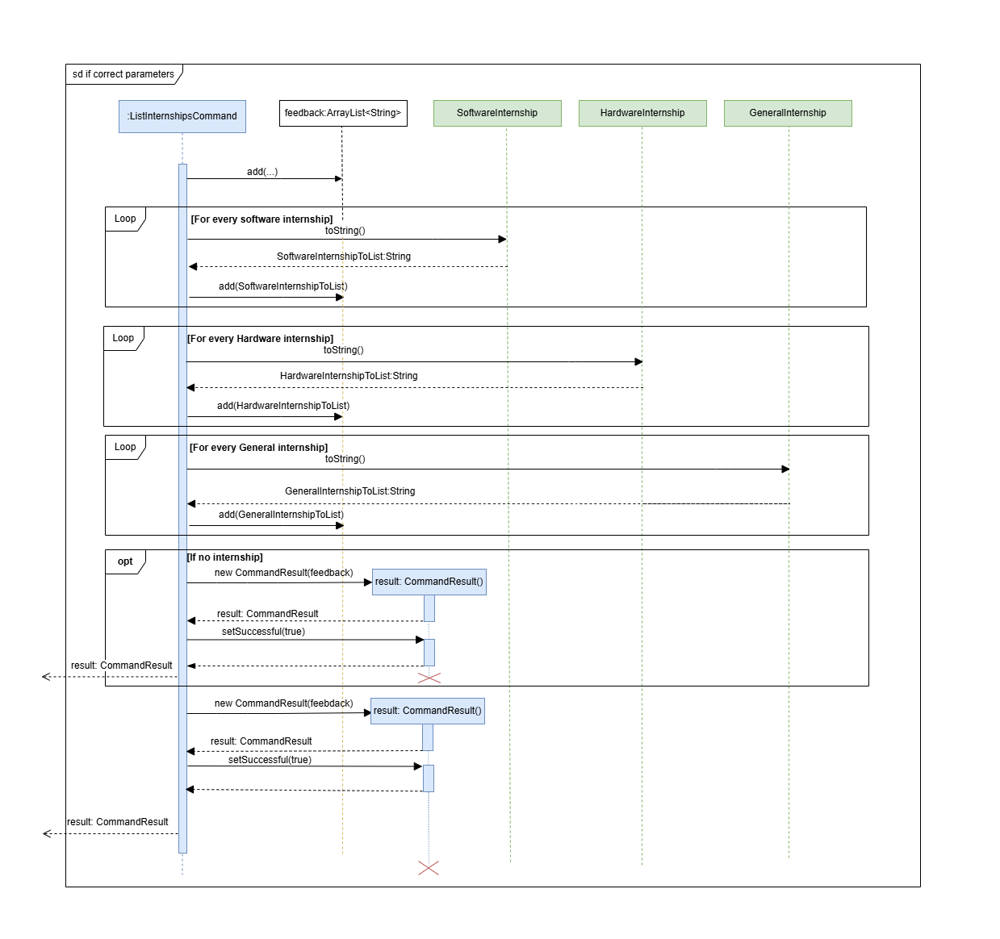
*Print calls, assert statements, logging, and other non-essential calls are omitted in the diagram for clarity.


### 5. Create/Update User Profile

**Overview**:

This command allows the user to update their own user profile with their personal details to aid in 
applications and CV creation/updating. The saved data  is immediately stored in the `userprofile.txt` file 
at `../data/userprofile.txt`.

**How the feature is implemented:**

* The `UserProfileCommand` class extends from the abstract class `Command`.
* The user is not required to specify any compulsory flags but can specify one of many optional flags such as `/name`
or `/mgoals` to their preference.  
* The `isValidParameters()` method ensures that the all provided flags match with predefined set of `OPTIONAL_PARAMETERS` 
* The `execute()` method updates the associated parameters in the `UserProfile user` passed in as an argument to this method.
  It then attempts to save the updated user profile.
  Feedback messages indicating success or failure, including errors such as invalid indices are returned.

**Why is it implemented this way:**

* The flags are not mandatory to allow users greater flexibility in utilizing this feature of the app, since the goals would
be to help them customize their CV and application processes. We aimed to make the user experience for simpler and more intuitive to understand,
and emulated the sequence logic seen in `edit` command.

### 6. Add/View Projects under User Profile

**Overview**:

This command allows the user to add a new project to their list of projects stored under their user profile.
The new project is immediately added to the `userprofile.txt` file at `../data/userprofile.txt`.

**How the feature is implemented:**

* The `ProjectCommand` class is an abstract class that extends from another the abstract class `Command`.
* The user can specify the type of project he wants to add as `general`, `software` or `hardware` in the input.
  Each type of internship has a separate class that extends the `ProjectCommand` class,
  `ProjectGeneralCommand`, `ProjectSoftwareCommand`, and `ProjectHardwareCommand`.
* These subclasses override the `isValidParameters()` and `execute()`
  methods to validate the parameters of the command, depending on the type of internship.
* The `execute()` method adds the new project to the list of projects
  stored in `UserProfile` which it obtains as a parameter.
  * `ProjectList` class stores the list of internships as a HashMap. Each type of `Project*TypeCommand` will insert
    the project into the correct list.

**Why is it implemented this way:**

* By abstracting each type of project into a separate class, the code achieves **SoC (Separation of Concerns)**
  design principle.
* Each subclass is now responsible for validating and executing the command for a specific type of project, enabling
  testing and debugging to be more focused and efficient.
* ***Note***: This implementation is modelled after the `AddInternshipCommand` structure, largely with only one exception -
  all flags the user can enter are mandatory (to specify a project all essential information is required as per our design
  requirements).


**Sequence Diagram:**
Keeping in mind the similarity to the `AddInternshipCommand` structure, to aid conciseness, the sequence diagrams for that
class can be referenced to understand execution logic for these commands. However, to help understand inheritance for this
command and how the three different project type classes extend from their superclasses, below is a class diagram for the same:


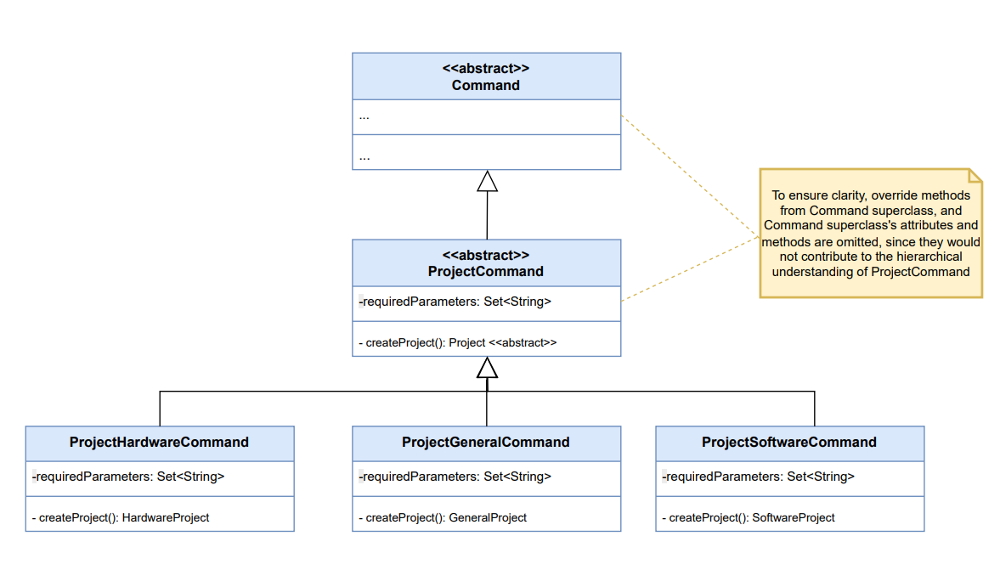

* Certain non-essential attributes and class methods are omitted in the diagram for clarity.


### Logging Guide

* We use `java.util.logging` package for logging.
* The `InternSprintLogger.java` class is responsible for setting up the logger and creating a singleton logger.
* This logger can be obtained by using `InternSprintLogger.getLogger()`.
* Log messages are output to a `.log` file which is found at `../log/InternSprint.log`.

## Product scope

### Target user profile

This product is designed for **NUS Computer Engineering undergraduates**, especially students **applying for internships** 
or jobs for the first time. It caters to those who **prefer a unified CLI-based platform** over a GUI, streamlining 
job application processes for tech-savvy users who **value automation and command-line control**.

### Value proposition

The product helps CEG students **effortlessly track and maintain job applications** at different stages using short 
commands, all within a unified CLI. Stay organized, save time, and streamline the application process with automation, 
ensuring a seamless and efficient job hunt.

## User Stories

| Version | As a ...    | I want to ...                                                                                                  | So that I can ...                                                                                     |
|---------|-------------|----------------------------------------------------------------------------------------------------------------|-------------------------------------------------------------------------------------------------------|
| v1.0    | New user    | View the user command guide easily                                                                             | learn more about the product as and when needed, and know how to work with the software               |
| v1.0    | Normal user | Add the job role, company and status of the job I have applied for                                             | easily identify where I have applied                                                                  |
| v1.0    | Normal user | List all the jobs I have applied for                                                                           | track my progress and have a masterlist reference of my applications                                  |
| v1.0    | Normal user | Delete certain job applications                                                                                | only see relevant data in the list                                                                    |
| v1.0    | Normal user | View the detailed job description                                                                              | have a better understanding of the role I am applying for                                             |
| v1.0    | Normal user | Save the previously stored data about the jobs I have applied to                                               | reopen the application and have my old data restored so I don't have to reenter everything repeatedly |
| v2.0    | New user    | Enter my goals for the year, as in what would be my ideal role, in which companies and what pay or time ranges | have a clear picture to refer back to when making applications                                        |
| v2.0    | New user    | Enter in my personal details like name, age major and preferences                                              | have a personal touch in my software                                                                  |
| v2.0    | New user    | Have some pictorial elements and visual representations of data                                                | be engaged and not have to deal with too text-heavy or boring visuals                                 |
| v2.0    | New user    | Add in my skills in different tech stacks and different soft skills                                            | keep my skill set updated and use it as a reference for different applications                        |
| v2.0    | Normal user | Note important details about the job interviews                                                                | well prepare for interviews                                                                           |
| v2.0    | Normal user | Mark jobs based on different stages on the job portal                                                          | be aware of which application to portal to check for updates, and which stage they are in             |
| v2.0    | Normal user | View HR details and contact number for the interviews                                                          | be aware of the point of contact for various applications                                             |
| v2.0    | Normal user | Record interview dates and time                                                                                | better track interviews                                                                               |

## Non-Functional Requirements

* Should work on any *mainsteam OS* as long as it has Java 17 or above installed.
* A user with above average typing speed for regular English text (i.e. not code, not system admin commands) should be 
able to accomplish most of the tasks faster using commands than using a mouse.
* The application should be able to handle sufficient amount of internships a CEG student might apply to without causing
any lag.

## Glossary

* *CEG* - Computer Engineering
* *CLI* - Command Line Interface
* *CV* - Curriculum Vitae
* *GUI* - Graphical User Interface
* *Mainstream OS* - Windows, Linux, Unix, MacOS
* *SoC* - Separation of Concerns
* *SRP* - Single Responsibility Principle

## Instructions for manual testing


> **Note:** These instructions only provide a starting point for testers to work on; testers are expected to do more 
> exploratory testing.

### 1. Start InternSprint Application

1. Follow the instructions given in our 
[User Guide Quick Start](https://ay2425s2-cs2113-t11a-3.github.io/tp/UserGuide.html#quick-start)
 to set up the application.

2. Expected: A welcome message and a prompt for user input.

### 2. Test Cases
For more depth and greater variety of test cases which fully explore our extended features we **highly recommend** you take a
look at sample commands in our [User Guide Feature List](https://ay2425s2-cs2113-t11a-3.github.io/tp/UserGuide.html#table-of-contents).

**2.1 Initial State**

1. Follow the instructions given in our [User Guide Quick Start](https://ay2425s2-cs2113-t11a-3.github.io/tp/UserGuide.html#quick-start)
2. Expected: A welcome message and a prompt for user input.

3. Test case: `help`
   
   Expected: List of all possible commands user may enter should be displayed.

4. Test case: `any non-command string`

   Expected: Error for an unrecognized command should appear.

**2.2 Add a new internship**
1. Test case: ` add general /c Google /r Human Resource /dept HR`

    Expected: Adds a general category of internship in Google, for an HR role, in the HR department. (These are
the most basic required parameters).
   

2. Test case: `add software /c Google /r Software Engineer /tech Java, Python`

    Expected:  Adds a software category of internship in Google, for a Software Engineer role, with tech stack of Java and 
Python. (These are the most basic required parameters).


3. Test case: `add hardware /c Google /r Hardware Engineer /hardtech Arduino, Raspberry Pi`

    Expected:  Adds a hardware category of internship in Google, for a Hardware Engineer role, with hardware tech stack of Arduino, Raspberry Pi.
(These are the most basic required parameters).


4. Test case: `add software /c IBM /r Data Analytics /tech Python, PowerBI /ex Good project showcase`

    Expected:  Adds a software category of internship in IBM, for a Data Analytics role, with tech stack of Python, PowerBI
and experience of good project showcases. (These are some extended parameters: more info on possible extended parameters in UG).

    *Note: you may extend this test case to other categories of internships, with more optional parameters.*


5. Test case: `add software /company Google /role Software Engineer`
    
    Expected: Should output an error message highlighting correct usage format as one of the basic required parameter `/tech` is missing.     

**2.3 List all internships**
1. Test case: `list`

    Expected: Should list all internships organized by category. Should not show extended parameters like `description` among others
(should just be the essential compulsory flag information).


2. Test case: `list /index 1`

    Expected: Should output error highlighting correct usage of list command.

**2.4 Delete an internship**
1. Test case: `delete`

    Expected: Should output error highlighting correct usage of delete command.


2. Test case: `delete /index 1`

    Expected: Should correctly delete the internship in the list at index 1. You may `list` all internships to confirm.


3. Test case: `delete /index -1`

    Expected: Should output error highlighting invalid index.

**2.5 Edit an internship**

1. Test case: `edit`

    Expected: Should output error highlighting correct usage of edit command.


2. Test case: `edit /index 1 /c Java /desc Some description`

    Expected: Should correctly edit the internship in the list at index 1 to new company of Java. 
This commmand is used to potentially explore adding more optional parameters if you forgot to add such parameters when creating
the internship. You may `list` all internships to confirm. (Can check optional parameters in UG)


3. Test case: `edit /c Google /desc Some description`

    Expected: Should output error highlighting invalid parameters. 

**2.6 Describe an internship**
1. Test case: `desc`

    Expected: Should output error highlighting correct usage of description command.


2. Test case: `desc /index 1`

    Expected: Should correctly show description of the internship in the list at index 1. 


3. Test case: `desc /index -1`

    Expected: Should output error highlighting invalid index.


**2.7 Find an internship**
1. Test case: `find`

    Expected: Should output error highlighting correct usage of find command.


2. Test case: `find software /c Google`

    Expected: Should find all software internships added, under company name Google.

**2.8 Adding interviews for internships**

1. Test case: `interviewfor `

    Expected: Should output error highlighting correct usage of add interview command.


2. Test case: `interviewfor /index 1 /date 2025-01-01 /start 10:00 /end 14:00 /type technical round`

    Expected: Should correctly add a technical interview to the internship in the list at index 1 with above timings.
(You can potentially explore adding more optional parameter according to user guide. You may `desc` this index internship to confirm it will not appear on listing.)


3. Test case: `interviewfor /date 2025-01-01 /start 10:00 /end 14:00 /type technical round`

    Expected: Should output error highlighting no index/invalid parameters. 

**2.9 Sorting interviews for internships**

1. Test case: `sortInterviews `

    Expected: Should sort all rounds of interviews added across multiple internships by date.

**2.10 Adding/Viewing user profile information**

1. Test case: `my /name John Doe /ind Software /c Google /r Developer /mgoals 100 applications /ygoals 2 internships`

    Expected: Should correctly edit your user profile information according to above optional parameters. (Can check optional parameters in UG)


2. Test case: `my`

    Expected: Since all parameters are optional to user, this command would successfully "edit"  your user profile information according to above optional parameters. 
(Since no flag/optional parameters provided - no changes).


3. Test case: `view user`

    Expected: Should display ASCII table to user of their profile information.

**2.11 Adding/Viewing projects information**

1. Test case: `project general /n Team Project /r Tester /dept Software Engineering /obj For the PE /desc Worked at identifying feature flaws in app /dur May-August`

    Expected: Should correctly add a general project according to above compulsary parameters. 
(All parameters are mandatory since they all hold valuable information for user. You may extend this to project general and project hardware)


2. Test case: `project software /n Team Project for CS2113 /r Unit Tester /pro Java, C++ /obj To get an A+ /desc Worked at identifying feature flaws in app /dur May-August`

    Expected: Should correctly add a software project according to above compulsory parameters.


3. Test case: `project hardware /n Team Project for EE2026 /r Ui Developer /hcomp Basys Board/obj To get an A+ /desc Worked at creating pixel art for the UI /dur May-August`

    Expected: Should correctly add a hardware project according to above compulsory parameters.


4. Test case: `view general`

    Expected: Should display ASCII table to user of their general projects.


5. Test case: `view software`

    Expected: Should display ASCII table to user of their software projects.


6. Test case: `view hardware`

    Expected: Should display ASCII table to user of their hardware projects.
